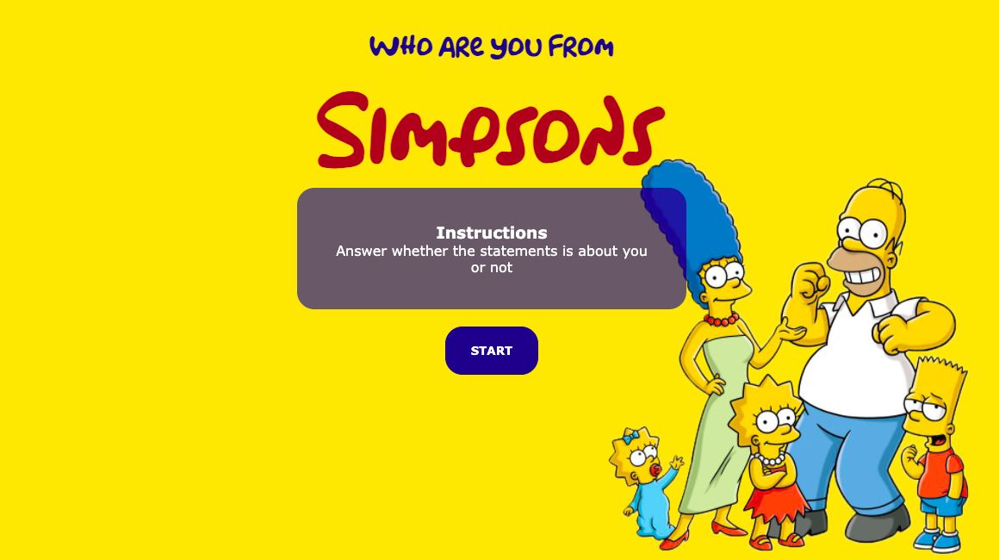

# The Simpsons Personality Quiz

Simple personality quiz created using ReactJS and JSON-server.\
The challenge was to create database design to access quiz keys and question options.

## Features

Quiz start/restart feature
View of answer options
View of quiz results 

### Installation

# Clone this repository
$ git clone [https://github.com/OlhaLatun/quiz.git](https://github.com/OlhaLatun/quiz.git)

# Go to the root directory
$ cd quiz

# Install dependencies
$ npm install

# Run the app in the development mode on [http://localhost:3000](http://localhost:3000)

$ npm start

or see deployed project on [https://olhalatun.github.io/quiz/](https://olhalatun.github.io/quiz/)

## Sources

The test is inspired by one of the best cartoon series ever existed :)\
The test is based on Myers-Briggs Type Indicator which makes the theory of psychological types\ described by C. G. Jung understandable and useful in people's lives.

